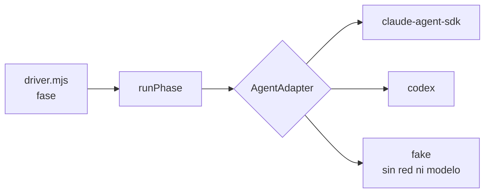

# Contrato · Agent Adapter

**Branch**: `002-control-plane` | Cubre FR-033, FR-034, y el componente *Agent Adapter Layer* de §11

## La costura ya existe

No hay que inventarla. El motor de v1 invoca al modelo por un único punto —`deps.runPhase(...)` en `packages/engine/src/driver.mjs:641`— y `wiring.mjs` ya elige entre dos caminos según la disponibilidad del SDK (`via: sdkAvailable() ? "agent-sdk" : "cli"`). Esa indirección existe por una razón declarada en el propio archivo: *"que el recorrido completo se pueda probar sin red, sin credenciales y sin modelo"*.

Esta feature **nombra** esa costura y le pone contrato. No la mueve.



Regla heredada del principio VI, trasladada de proveedores a runtimes: **si soportar un runtime exige cambiar el motor, la interfaz está mal y se arregla la interfaz.** No se ramifica el driver con un `if`.

## Interfaz

```ts
interface AgentAdapter {
  /** Identificador estable. Es lo que guarda Agent.runtime. */
  readonly id: string

  /** Qué sabe hacer. El motor pregunta antes de asumir, igual que con los proveedores. */
  capabilities(): AdapterCapabilities

  /** ¿Puede funcionar aquí y ahora? Se llama en el doctor, no a mitad de un run. */
  preflight(): Promise<{ ok: boolean; causa?: string; accion?: string }>

  /** Ejecuta una fase. Es el reemplazo tipado de deps.runPhase. */
  runPhase(req: PhaseRequest): Promise<PhaseResult>
}

interface AdapterCapabilities {
  /** Puede retomar una sesión anterior. Si es false, el motor abre sesión nueva cada fase. */
  resume: boolean
  /** Reporta coste en USD. Si es false, el techo de gasto del hito no puede aplicarse a él. */
  cost: boolean
  /** Acepta un nivel de esfuerzo. */
  effort: boolean
  /** Puede correr hooks dentro de su subproceso. */
  hooks: boolean
  /** Modelos que expone, si los enumera. */
  models: string[] | 'desconocido'
}

interface PhaseRequest {
  phase: string            // RED, GREEN, REFACTOR, REVIEW...
  taskId: string
  task: unknown
  item: unknown
  cwd: string              // el worktree de la tarea, aislado
  resume: string | null    // sessionId anterior, o null para sesión nueva
  model: string
  effort?: string
  prompt: string
  tier?: string
  env: Record<string, string>   // NUEVO en v2: el entorno, ya construido por la bóveda
}

interface PhaseResult {
  ok: boolean
  sessionId?: string
  usd?: number | null
  text?: string
  budgetExhausted?: boolean
  subtype?: string
}
```

## Qué cambia respecto de v1

Un solo campo: **`env`**. Hoy el subproceso hereda el entorno del motor. En v2 el entorno lo construye la bóveda a partir del grant vigente y se entrega explícito (FR-044, y la prueba `env-no-hereda` del contrato de bóveda).

El fallo que esto cierra: heredar el entorno propaga al subproceso **todas** las credenciales que el proceso padre tenga cargadas, tenga grant o no. Un agente al que se le concedió el tracker acaba con la clave del modelo, la del SCM y lo que hubiera en el shell del operador — y la capa de grants, que es el diferencial del producto, queda decorativa. El grant solo significa algo si el entorno es exactamente lo que el grant autoriza y nada más.

## Reglas del adapter

**1. Degradar visible, nunca en silencio.** Un adapter que no soporta `resume` lo declara en `capabilities()`; el motor abre sesión nueva cada fase y lo dice. No se finge la capacidad. Es literalmente lo que ya hace la capa de proveedores: *"un proveedor que no soporta dependencias explícitas no degrada el recorrido: lo declara"*.

**2. `cost: false` desactiva el techo, y avisa.** Un adapter que no reporta gasto no puede ser gobernado por el techo de USD. El motor lo dice al arrancar el run en vez de aplicar un límite que no puede dispararse — el mismo fallo que ya corrigió v1 cuando `callsPerItem` estaba en el esquema y nadie lo hacía cumplir: *"un límite que se lee como puesto y no lo está es peor que no tenerlo"*.

**3. El adapter no decide el veredicto.** Devuelve lo que el runtime produjo. Quien decide si una fase pasó es el gate, por exit code. Un adapter que interpreta la prosa del modelo para devolver `ok: true` reintroduce el verde inventado por la puerta de atrás.

**4. El adapter no toca el estado.** No escribe archivos de run, no marca tareas, no consume presupuesto. Eso lo hace el driver con lo que el adapter devolvió. Un escritor más es un escritor de más.

**5. Los hooks corren dentro.** El hook de TDD y el de límite de autonomía viven en el subproceso del runtime. Un adapter que no puede ejecutar hooks declara `hooks: false` y **no es elegible para el rol de implementador** — sin el hook, el principio I depende de que el prompt se acuerde, y ya está medido que deja de funcionar en la tercera iteración.

**6. El revisor no hereda el transcript.** `runPhase` con `phase: 'REVIEW'` recibe `resume: null` siempre. Si el revisor retoma la sesión del implementador, hereda su razonamiento y la revisión se vuelve confirmación — el riesgo que §12 de la definición de producto nombra explícitamente.

## Los adapters del alcance

| Adapter | Rol | Estado |
|---|---|---|
| `claude-agent-sdk` | Referencia. Implementador y planificador | Ya existe en v1, se formaliza |
| `codex` | Segundo runtime. **Revisor** | Nuevo |
| `fake` | Pruebas sin red, sin credenciales y sin modelo | Ya existe en v1 |

**Por qué exactamente dos, y no uno ni veinte.** Uno no valida nada: con un solo adapter, la abstracción es una capa de indirección sin prueba, y la regla de revisor-distinto-del-implementador (FR-034) no se puede cumplir. Veinte es la competencia que la definición de producto declara perdida de antemano: *"los orquestadores establecidos ya superan los veinte. Dos runtimes bien aislados valen más que veinte a medias."*

El segundo adapter tiene una función concreta además de existir: es la prueba de que el contrato aísla. Si añadir Codex obliga a tocar `driver.mjs`, el contrato está mal y esta feature lo descubre antes de que haya un tercero.

## Suite de contrato

Igual que la suite de proveedores de v1 (`providers/contract.test.mjs`), un adapter nuevo se declara listo cuando pasa la suite completa. Correrla es el paso 4 de añadir uno, y ninguno de los cinco toca el motor.

| Prueba | Qué afirma |
|---|---|
| `capacidades-honestas` | Lo que `capabilities()` declara es lo que hace. Se ejerce cada capacidad declarada `true` |
| `preflight-diagnostica` | Sin credencial o sin binario, `preflight` devuelve causa y acción; no revienta a mitad de un run |
| `cwd-respetado` | El subproceso corre en el worktree indicado y no escribe fuera de él |
| `env-exacto` | El subproceso recibe exactamente `req.env`. Ni una variable heredada de más |
| `sin-resume-sesion-nueva` | Con `capabilities().resume === false`, cada fase abre sesión nueva |
| `revisor-sin-transcript` | `phase: 'REVIEW'` nunca recibe `resume` distinto de `null` |
| `no-escribe-estado` | Se mide el disco del `home` antes y después: el adapter no escribió nada |
| `no-interpreta-veredicto` | Con el gate en rojo, el adapter no devuelve `ok: true` por mucho que el texto del modelo diga que está bien |
| `coste-o-declarado` | O reporta `usd`, o declara `cost: false`. No devuelve `usd: 0` fingiendo |
| `cancelable` | Una fase abortada termina el subproceso y no deja huérfanos |
| `sin-secreto-en-argv` | Ningún valor del `env` aparece en los argumentos del proceso |
| `eventos-normalizados` | Con `alEvento` (opcional para quien llama), lo que el runtime dice y hace llega como los cinco tipos del transcript —`texto`, `herramienta`, `resultado_herramienta`, `resultado`, `error`—, en orden; un callback que falla no tumba la fase (spec 004, FR-004) |

## Añadir un adapter

Cinco pasos, ninguno toca el motor — el mismo camino que ya funciona para los proveedores de tickets:

1. Copiar el adapter `fake`.
2. Declarar `capabilities()` **con la verdad**. Empezar con casi todo en `false` es correcto y produce un recorrido que funciona.
3. Implementar `preflight` y `runPhase`.
4. Correr la suite de contrato hasta verde.
5. Registrarlo y apuntar `Agent.runtime` a su `id`.
