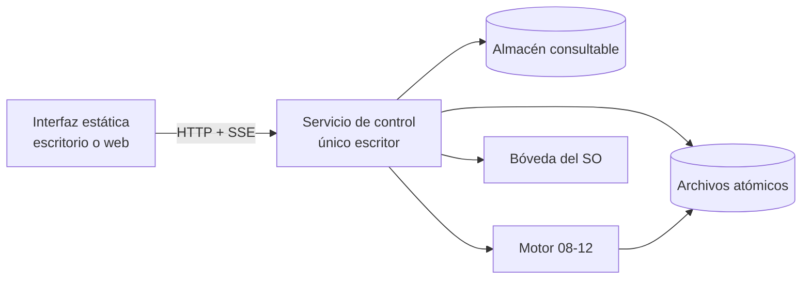

# Contrato · API del servicio de control

**Branch**: `002-control-plane`

## Por qué existe esta costura

La interfaz se compila como export estático: no tiene servidor, no tiene rutas de API, no tiene acciones de servidor. Todo lo que necesita saber o cambiar lo pide a un servicio local. Esto no es una limitación que sufrimos, es la propiedad que hace posible que **el mismo build sea la app de escritorio y la app web** (FR-001, SC-008).

Y tiene un segundo efecto, más importante: mantiene vivo el principio III de la constitution. El servicio es el único escritor. La interfaz nunca toca el disco, ni el almacén, ni un worktree. Si mañana hay tres ventanas abiertas y una sesión de CLI, siguen siendo un escritor y cuatro lectores.



## Transporte

| Aspecto | Decisión |
|---|---|
| Base | `http://127.0.0.1:<puerto>` — nunca `0.0.0.0` |
| Formato | JSON, `application/json` |
| Eventos | SSE en `/events`, un solo canal, con `Last-Event-ID` para reconexión |
| Autenticación | Token de sesión generado al arrancar, escrito en un archivo con permisos `0600`. En escritorio lo lee el shell; en web lo pega el operador una vez |
| CORS | Allowlist explícita: el origen de Tauri y el origen web configurado. Sin `*` |
| Versión | `/v1/...`. Un cambio incompatible sube la versión, no rompe clientes |

**Por qué token y no "es localhost, da igual":** cualquier página web que el operador tenga abierta puede hacer peticiones a `127.0.0.1`. Sin token, un anuncio en otra pestaña enumera sus proyectos y sus credenciales. El fallo tiene nombre y ya ocurrió en otros productos de escritorio con servidor local.

## Forma de las colecciones

Toda ruta que devuelve varios elementos devuelve **el mismo sobre**, siempre:

```json
{
  "items": [ ... ],
  "cursor": null,
  "avisos": []
}
```

`cursor` es `null` cuando no hay más páginas. `avisos` es una lista de
`{ codigo, causa, accion }` — vacía casi siempre.

**Por qué un sobre y no el array desnudo.** Esto se decidió tarde y a la fuerza:
el servicio había elegido envolver con una clave por recurso (`{agentes: [...]}`)
y la interfaz había elegido arrays desnudos, cada lado razonablemente, porque el
contrato no decía nada. Once pantallas y catorce rutas después, la diferencia
apareció al juntarlos.

Los tres motivos por los que gana el sobre:

1. **`avisos` lleva algo que no tiene otra casa.** Cuando el servicio lee runs y
   un archivo de estado está ilegible, eso tiene que **verse**: es degradación
   visible, que es lo que este producto exige en todas partes. Con un array
   desnudo, la única salida es omitir la fila en silencio — y una lista a la que
   le faltan elementos sin decirlo es peor que un error.
2. **`/v1/audit` ya lo necesitaba.** Declara `cursor` y `filtros_aplicados`, y
   ninguno cabe en un array.
3. **Un solo lector y un solo paginador.** Con una clave distinta por recurso
   (`agentes`, `runs`, `credenciales`), un cliente genérico necesita una tabla
   de traducción que hay que mantener sincronizada con las rutas.

**Cada elemento se devuelve completo.** Nada de arrays de identificadores con
tablas de consulta al lado: a la escala de este producto —un operador, veinte
proyectos— normalizar la respuesta solo traslada el trabajo de unir al cliente,
y lo hace en doce sitios en vez de uno.

Una ruta con datos extra propios los pone **junto** a `items`, no dentro:
`/v1/audit` añade `filtros_aplicados`.

## Forma de los errores

Un único formato, siempre, porque NFR-006 exige que todo error nombre la causa y la acción siguiente.

```json
{
  "error": {
    "codigo": "credencial_sin_grant",
    "causa": "El agente 'implementador' no tiene grant vigente para la credencial 'linear-api' en el proyecto 'noxloop'.",
    "accion": "Concede el grant desde Credenciales → linear-api → Agentes, o resuelve la entrada de bandeja inb_4f2a.",
    "objeto": { "tipo": "credential", "id": "cred_..." }
  }
}
```

`causa` es texto completo, no un resumen. `accion` nombra una pantalla o una operación concreta. Un error sin `accion` no pasa revisión.

## Endpoints

### Salud y sesión

| Método | Ruta | Devuelve |
|---|---|---|
| `GET` | `/v1/health` | `{ version, esquema, home, escritorUnico: true, arranque }` |
| `GET` | `/v1/capabilities` | Qué sabe hacer este servicio: runtimes disponibles, backend de bóveda en uso, proveedor de integraciones, si el motor está presente |

`/v1/health` es lo primero que pide la interfaz. Si no responde, la interfaz muestra "el servicio no está corriendo" con la acción concreta (FR-005) — nunca una pantalla en blanco ni datos rancios.

### Proyectos · etapa 00

| Método | Ruta | Notas |
|---|---|---|
| `GET` | `/v1/projects` | Lista con estado y contadores. Responde en <1s con 20 proyectos (NFR-002) |

**Los contadores van anidados bajo `contadores`**, y el contrato tuvo que decirlo porque solo decía la palabra:

```json
{ "id": "...", "nombre": "...", "estado": "BOOTSTRAPPED",
  "contadores": { "entradas_bandeja": 2, "agentes": 3, "conexiones": 1,
                  "credenciales": 4, "recomendaciones_pendientes": 0 } }
```

**El fallo que esto cierra ya estaba en producción.** El almacén devolvía campos planos (`bandeja_esperando`, `agentes`) y la interfaz leía `contadores.entradas_bandeja`: dos desacuerdos a la vez, anidamiento y nombre. Los badges de «N en bandeja» y «N agentes» de la lista de proyectos **no se pintaban nunca** contra el servicio real, y el síntoma no es un error — es una fila que parece no tener nada pendiente.

Anidados y no planos porque separan **identidad** de **agregado**: `nombre` describe al proyecto y `entradas_bandeja` describe su situación ahora mismo. Mezclarlos hace que cada campo nuevo del proyecto tenga que comprobarse contra los nombres de los contadores.
| `POST` | `/v1/projects` | Crea. Cuerpo: `{ origen, nombre, ruta_local?, remoto?, plantilla? }` |
| `GET` | `/v1/projects/:id` | Detalle completo |
| `PATCH` | `/v1/projects/:id` | Identidad y metadatos. **No** cambia `estado` |
| `DELETE` | `/v1/projects/:id` | Deja de gestionarlo. **No borra el repositorio del operador** |

`POST /v1/projects` con `origen: "local"` sobre una carpeta que no es repositorio git devuelve `error.codigo = "no_es_repositorio"` con la acción de inicializarlo (escenario 4 de US1).

`POST` con `origen: "nuevo"` sobre un destino no vacío devuelve `destino_no_vacio` y ofrece adoptarlo como existente (escenario 3 de US2).

| Método | Ruta | Notas |
|---|---|---|
| `GET` | `/v1/templates` | Las plantillas disponibles para `origen: "nuevo"` |

**Por qué esta ruta existe, y se añadió tarde.** El contrato declaraba que `POST /v1/projects` acepta `plantilla` y no decía dónde se enumeran las plantillas. Quien construyó la pantalla se encontró con que solo tenía dos salidas: inventar la lista en el cliente —la interfaz decidiendo producto— o pedir al operador que escriba un identificador que no puede conocer. Lo señaló en vez de elegir por su cuenta, que es la respuesta correcta a un hueco del contrato.

Devuelve `{ id, nombre, descripcion, stack }` por plantilla. Un servicio sin plantillas devuelve lista vacía, y la interfaz lo dice con esas palabras y deja escribir el identificador a mano — degradar visible, no fingir.

### Discovery · etapa 01

| Método | Ruta | Notas |
|---|---|---|
| `POST` | `/v1/projects/:id/scan` | Arranca el scanner. Devuelve `{ snapshot_id }` de inmediato; el progreso va por SSE |
| `DELETE` | `/v1/scans/:snapshot_id` | Cancela. **Sin dejar estado parcial** (FR-015) |
| `GET` | `/v1/projects/:id/snapshot` | El snapshot vigente con sus hallazgos |
| `PATCH` | `/v1/snapshots/:id/findings/:finding_id` | `{ decision, valor_corregido? }` (FR-014) |
| `POST` | `/v1/snapshots/:id/accept` | Acepta el snapshot → `DISCOVERED` |

**Garantía que este endpoint debe poder demostrar (FR-011):** el scanner no escribe. La verificación es mecánica y vive en el test, no en la promesa: `git status --porcelain` antes y después, byte a byte igual.

### Constitution y guidelines · etapas 02–04

| Método | Ruta | Notas |
|---|---|---|
| `POST` | `/v1/projects/:id/constitution/propose` | Borrador derivado del snapshot, cada apartado marcado `detectado`/`inferido`/`vacio` |
| `PUT` | `/v1/projects/:id/constitution` | Fija. Escribe en el repo y pasa a `CONSTITUTED` |
| `GET` | `/v1/projects/:id/constitution` | Vigente + historial de enmiendas |
| `POST` | `/v1/projects/:id/constitution/amend` | Exige `{ principio, fallo_que_motiva, que_se_rompe_si_no }`. **Sin esos tres campos, 400** |
| `GET/PUT` | `/v1/projects/:id/guidelines/:area` | Por área |
| `PUT` | `/v1/projects/:id/design` | Opcional. Omitirla no bloquea (FR-023) |

El `400` de `amend` sin los tres campos es deliberado y viene de la constitution de este repositorio: *"una enmienda sin un fallo detrás no es una enmienda: es una preferencia"*. Lo que exigimos de nosotros lo exige el producto.

**El cuerpo de `PUT /v1/projects/:id/constitution`** lleva las **dos** representaciones:

```json
{
  "markdown": "# Constitution\n\n## I. ...",
  "apartados": [
    { "clave": "arquitectura", "contenido": "...", "origen": "detectado",
      "evidencia": [{ "ruta": "package.json", "linea": 8 }] }
  ]
}
```

Las dos, y no solo el markdown, porque **el origen de cada apartado no se puede deducir de la prosa**. Deducirlo sería exactamente el contexto inventado que prohíbe el principio X: un apartado inferido que llega marcado como detectado se convierte en la regla del proyecto y el runtime la aplica durante meses sin que nadie lo revise.

`GET` devuelve la misma forma. Si un servicio devuelve la constitution **sin** `apartados`, la interfaz lo dice —*"el origen de cada parte no viene en la respuesta"*— en vez de pintar marcas que no tiene.

### Bootstrap · etapa 05

| Método | Ruta | Notas |
|---|---|---|
| `POST` | `/v1/projects/:id/bootstrap/analyze` | Detecta lo existente **antes** de proponer (FR-024) |
| `GET` | `/v1/projects/:id/recommendations` | Cada una con su `diff` ya calculado |
| `POST` | `/v1/recommendations/:id/apply` | Escribe. Idempotente |
| `POST` | `/v1/recommendations/:id/customize` | `{ diff_modificado }` |
| `POST` | `/v1/recommendations/:id/skip` | `{ motivo? }` — se registra (FR-027) |
| `POST` | `/v1/projects/:id/bootstrap/complete` | → `BOOTSTRAPPED` |

**Invariante de este bloque:** `GET /recommendations` devuelve el `diff` exacto que se escribirá. `apply` no recalcula nada: aplica lo que el operador vio. Si el árbol cambió desde que se calculó, `apply` falla con `diff_obsoleto` y pide recalcular. Aplicar algo distinto de lo mostrado es la forma exacta en que se pierde la confianza en un instalador.

### Conexiones y credenciales · etapa 06 y §12

| Método | Ruta | Notas |
|---|---|---|
| `GET` | `/v1/projects/:id/connections` | |
| `POST` | `/v1/projects/:id/connections/authorize` | Arranca el flujo. Devuelve `{ url_autorizacion, session_token, expira }` |
| `POST` | `/v1/connections/:id/callback` | Cierra el flujo |
| `DELETE` | `/v1/connections/:id` | Revoca |
| `GET` | `/v1/credentials` | Inventario. **Nunca incluye el valor** |
| `POST` | `/v1/credentials` | Registra. El valor va a la bóveda; la respuesta devuelve huella |
| `POST` | `/v1/credentials/:id/rotate` | Nueva huella, grants conservados (FR-047) |
| `GET` | `/v1/credentials/:id/reach` | **Vista inversa** (FR-045): agentes y proyectos que la alcanzan hoy |
| `DELETE` | `/v1/credentials/:id` | Revoca |
| `GET/POST` | `/v1/grants` | La tripleta. Filtrable por `?agent_id=`, `?project_id=` y `?credential_id=` |
| `DELETE` | `/v1/grants/:id` | |

**Las dos direcciones de la misma pregunta.** `/v1/credentials/:id/reach` contesta *"qué agentes y proyectos alcanzan esta credencial hoy"* — es la vista inversa de FR-045, y es la que se mira cuando la pregunta es si un secreto está más expuesto de lo que se creía.

`GET /v1/grants?agent_id=` contesta la girada: *"qué alcanza este agente"*. Es la que se mira al configurar la flota, antes de dejarlo correr. Las dos hacen falta porque se hacen en momentos distintos y con intenciones distintas; publicar solo una obliga a que la otra se resuelva filtrando en el cliente, y un filtro en el cliente sobre datos de autorización es un filtro que alguien puede quitar.

Ambas respetan vigencia y revocación: un grant revocado existe como fila y **no alcanza nada**.
| `GET` | `/v1/audit` | Paginado, filtrable. **Solo lectura. No existe POST, PATCH ni DELETE** (FR-049) |

**Los parámetros de `/v1/audit`**, nombrados aquí porque "filtrable" no es una especificación: `?desde=` y `?hasta=` (instantes ISO), `?actor=`, `?accion=` (prefijo, para que `grant.` traiga todas las de grants), `?objeto_tipo=`, `?resultado=` (`permitido|denegado|error`), `?cursor=` y `?limite=`.

Un parámetro que el servicio no reconozca se **ignora**, y la respuesta declara en `filtros_aplicados` cuáles honró. Sin eso, la interfaz enseñaría filas que no cumplen el filtro recién escrito y el operador creería estar viendo un subconjunto que no es — en una pantalla de auditoría, eso es peor que no filtrar.

**Regla que atraviesa todo este bloque:** ninguna respuesta de ningún endpoint —ni siquiera un mensaje de error, ni una traza— contiene el valor de una credencial. La prueba no se escribe sobre la intención: se serializa la respuesta completa de cada endpoint y se busca el valor conocido dentro (NFR-004).

### Flota · etapa 07

| Método | Ruta | Notas |
|---|---|---|
| `GET/POST` | `/v1/projects/:id/agents` | |
| `PATCH/DELETE` | `/v1/agents/:id` | |
| `POST` | `/v1/projects/:id/activate` | Valida que la flota cumple las reglas → `ACTIVE` |

`activate` rechaza con `revisor_comparte_runtime` si el revisor y el implementador comparten runtime (FR-034). Se valida al guardar, no al ejecutar: un error de configuración descubierto a mitad de un run cuesta el run entero.

### Bandeja

| Método | Ruta | Notas |
|---|---|---|
| `GET` | `/v1/inbox` | De todos los proyectos, más reciente primero |
| `GET` | `/v1/inbox/:id` | Con la causa textual **completa** (FR-062) |
| `POST` | `/v1/inbox/:id/resolve` | `{ decision, motivo? }` |
| `GET` | `/v1/dashboard` | Indicadores agregados (FR-060) |

### Handoff al motor

| Método | Ruta | Notas |
|---|---|---|
| `POST` | `/v1/projects/:id/runs` | Lanza un ciclo. Cuerpo: `{ item?: string }`. `409` si el proyecto no está `ACTIVE`, nombrando la etapa que falta (FR-064) |
| `GET` | `/v1/projects/:id/runs` | **Lectura del estado en archivos.** El servicio no lo escribe |
| `GET` | `/v1/runs/:id` | |

**Invariante (FR-002, escenario 2 de US8):** el estado del run lo escribe el motor, no este servicio. Estos tres endpoints leen archivos y los proyectan. Hay un test que mide el disco antes y después de un `GET`, igual que el que ya protege el board de v1.

## Eventos (SSE)

Un solo canal, `GET /v1/events`. Cada evento lleva `id`, `tipo`, `project_id?` y `datos`.

| Tipo | Cuándo |
|---|---|
| `scan.progreso` | `{ archivos_vistos, total_estimado, fase }` |
| `scan.hallazgo` | Un hallazgo nuevo, para que la lista crezca en vivo |
| `scan.terminado` / `scan.cancelado` | |
| `proyecto.estado` | Transición de la máquina de estados |
| `recomendacion.aplicada` | |
| `conexion.estado` | |
| `credencial.por_expirar` | Disparado por el aviso configurable (FR-046) |
| `bandeja.entrada` | Entrada nueva — es lo que hace que la bandeja sea útil sin recargar |
| `bandeja.resuelta` | |
| `run.estado` | Proyección del estado del motor |
| `servicio.parando` | Para que la interfaz distinga un cierre limpio de una caída |

**Reconexión:** el cliente manda `Last-Event-ID` y el servicio reenvía lo perdido desde un buffer acotado. Si el hueco excede el buffer, manda `sincronizar_completo` y la interfaz vuelve a pedir el estado. Nunca se muestra estado rancio como si fuera fresco (FR-005).

## Concurrencia

| Situación | Comportamiento |
|---|---|
| Dos ventanas sobre el mismo proyecto | Ambas leen; las mutaciones se serializan en el servicio |
| Dos servicios apuntando al mismo `home` | El segundo detecta el lock existente y se niega a arrancar, nombrando el PID |
| Mutación con estado obsoleto | `ETag` / `If-Match` en `PUT` y `PATCH`; `412` si cambió por debajo |
| El motor corriendo mientras el operador edita la constitution | Permitido. El contexto se compila al lanzar el run, no continuamente |

## Lo que este contrato prohíbe

- Ningún endpoint devuelve el valor de una credencial. Ninguno.
- Ningún endpoint escribe el estado del run. Solo el motor.
- Ningún endpoint edita o borra auditoría.
- Ningún endpoint crea una `DangerPolicy` habilitada.
- Ningún endpoint acepta contenido de terceros como instrucción: descripciones de tickets, comentarios de PR y respuestas de APIs externas entran como datos y se marcan como tales en todo el camino (FR-052).
