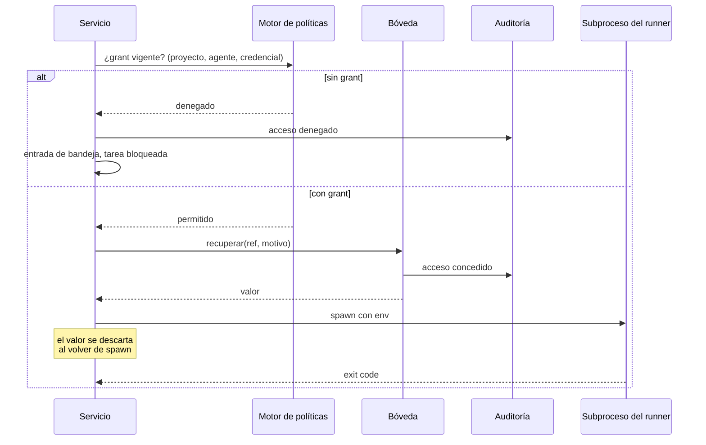

# Contrato · Bóveda de credenciales

**Branch**: `002-control-plane` | Cubre FR-040 … FR-051, NFR-004

## El fallo que esta capa evita

Un secreto filtrado no se arregla con un parche: se rota, se audita y se explica. Todo lo demás de esta feature admite un segundo intento; esto no. Por eso la bóveda tiene contrato propio, prueba propia y una regla que no se negocia:

> **El valor de una credencial existe en exactamente dos sitios: el backend de secretos del sistema operativo, y el entorno del subproceso que tiene grant, durante el tiempo que ese subproceso vive.**

En ningún otro lugar. No en el almacén, no en un archivo de estado, no en un log, no en una respuesta HTTP, no en un mensaje de error, no en un transcript, no en la interfaz, no en una variable de módulo del servicio.

## Corrección sobre el supuesto inicial

La investigación técnica desmontó la vía que parecía obvia: **`tauri-plugin-stronghold` no usa el keychain del sistema operativo.** Guarda un fichero cifrado protegido por una contraseña que la aplicación debe proporcionar — y esa contraseña hay que guardarla en algún sitio, que debería ser el keychain, con lo cual Stronghold no aporta la pieza que necesitamos.

No existe plugin oficial de Tauri para el keychain. La vía verificada es un **comando Rust sobre el crate `keyring`**, que resuelve Keychain en macOS, Credential Manager en Windows y Secret Service en Linux.

Consecuencia de diseño, y es una mejora: **los comandos de la bóveda no se exponen al webview.** La interfaz nunca puede pedir un valor porque no existe la ruta para pedirlo. Rust obtiene el secreto y lo entrega al servicio, que lo inyecta al subproceso. La interfaz solo ve huellas.

## Interfaz

```ts
interface Vault {
  /** Guarda un valor. Devuelve la referencia y la huella. Nunca devuelve el valor. */
  guardar(ref: VaultRef, valor: string): Promise<{ ref: VaultRef; huella: string }>

  /** Recupera para inyección. Solo el servicio la llama, nunca la interfaz. */
  recuperar(ref: VaultRef, motivo: MotivoDeAcceso): Promise<string>

  /** Existe sin revelar. Es lo que usa la interfaz. */
  existe(ref: VaultRef): Promise<boolean>

  /** Huella del valor actual. Para detectar rotación y comparar sin revelar. */
  huella(ref: VaultRef): Promise<string | null>

  borrar(ref: VaultRef): Promise<void>

  /** Qué backend está activo y por qué. La interfaz lo muestra. */
  backend(): { tipo: 'keychain_so' | 'archivo_cifrado'; motivo: string }
}

type VaultRef = string  // `noxloop:<workspace>:<credential_id>` — opaca, sin significado adivinable

interface MotivoDeAcceso {
  grant_id: string
  project_id: string
  agent_id: string
  proposito: 'lanzar_runner' | 'llamar_api' | 'clonar_repo' | 'sesion_ssh'
}
```

`recuperar` exige `MotivoDeAcceso` no por burocracia: es lo que hace que la auditoría sea automática en vez de recordada. Un acceso sin motivo no compila, y así no hay camino donde alguien "olvidó" registrar el acceso. El registro es parte de la operación, igual que en el motor el intento se consume al intentarlo y no en un reporte posterior.

## Backends

| | `keychain_so` (primario) | `archivo_cifrado` (alternativa) |
|---|---|---|
| Implementación | Crate `keyring` desde un comando Rust | Archivo cifrado con clave derivada de passphrase |
| macOS | Keychain | — |
| Windows | Credential Manager | — |
| Linux | Secret Service / kwallet | Cuando no hay Secret Service |
| Headless, contenedor, CI | No disponible | Único camino |

**La selección no es silenciosa.** Al arrancar, el servicio determina el backend y lo expone en `/v1/capabilities`. La interfaz lo muestra siempre. Caer al archivo cifrado sin que el operador lo sepa es cambiarle el modelo de amenaza sin decírselo — y un servidor Linux sin Secret Service es exactamente el caso donde pasaría.

## Inyección al subproceso



Reglas de la inyección (FR-044):

1. El valor se pasa **solo** por el entorno del subproceso, nunca por argumentos de línea de comandos — `ps` los muestra a cualquier proceso de la máquina.
2. El servicio no guarda el valor en ninguna estructura que sobreviva a la llamada a `spawn`.
3. El entorno del subproceso se construye explícitamente: solo las variables que ese runner necesita. Heredar el entorno del servicio propaga todo lo que haya ahí.
4. Ningún secreto llega al subproceso sin grant vigente verificado **en ese instante**, no al planificar.

## Redacción antes de persistir

FR-050 dice "antes", y la palabra es el contrato. Redactar después significa que hubo un instante en que el secreto estuvo en disco.

```ts
interface Redactor {
  /** Todas las huellas conocidas de la bóveda, para buscar coincidencias. */
  cargarHuellas(): Promise<void>
  /** Devuelve el texto con cada secreto reemplazado por su marca. */
  redactar(texto: string): string
  /** Igual sobre estructuras, recursivo. */
  redactarObjeto<T>(obj: T): T
}
```

Pasan por el redactor, sin excepción: transcripts de agente, salida de gates, evidence packets, logs del servicio, detalle de eventos de auditoría, cuerpos de error, y cualquier respuesta de la API.

El reemplazo es `[redactado:<nombre-credencial>]`. Nombrar cuál era hace el log útil para diagnosticar sin revelar nada — un `[redactado]` anónimo obliga a adivinar qué credencial falló.

**El redactor busca por valor, no por nombre de variable.** Un secreto que un agente copió a mitad de un mensaje no lleva etiqueta.

## SSH

SSH se trata aparte porque es el agujero por el que se escapa toda la gobernanza: dentro de una sesión SSH, los hooks locales no corren y la lista de comandos permitidos del shell local deja de aplicar (FR-048).

| Control | Regla |
|---|---|
| Huella del host | Fijada al registrar. `StrictHostKeyChecking=yes`. Un host desconocido es un bloqueo, nunca una aceptación silenciosa |
| Comandos | Allowlist. Por defecto solo lectura y diagnóstico |
| Escritura y despliegue | Autorización explícita por la bandeja, por sesión, no permanente |
| Bitácora | **Cada comando ejecutado**, no la apertura de la sesión |
| Agente SSH | Sin `ForwardAgent`. Reenviar el agente entrega las llaves al host remoto |

**La allowlist es la segunda capa, no la primera.** La constitution de este repositorio lo midió: con una lista de comandos prohibidos, **45 de 57 grafías la sortearon** — un prefijo, una comilla, un intérprete. Alargar la lista produce el verde inventado. Aquí se aplica el mismo criterio: lo que se permite es lo que la tarea declara necesitar, y todo lo demás se rechaza diciendo cómo pedirlo.

## Pruebas obligatorias

Estas pruebas no verifican la intención. Serializan el objeto real y buscan el valor conocido dentro.

| Prueba | Qué afirma |
|---|---|
| `boveda-no-serializa-valor` | Serializar cualquier entidad del inventario no produce el valor, en ningún campo, ni truncado |
| `api-no-filtra-secreto` | Se registra un valor centinela, se llama **a todos** los endpoints, y el centinela no aparece en ninguna respuesta — ni en los errores |
| `estado-no-filtra-secreto` | Tras un run completo, ningún archivo de estado contiene el centinela |
| `logs-no-filtran-secreto` | Ídem sobre logs del servicio y del motor |
| `evidencia-redactada-antes` | El evidence packet en disco nunca contuvo el centinela — se verifica sobre el archivo escrito, no sobre el objeto en memoria |
| `sin-grant-no-hay-valor` | `recuperar` sin grant vigente lanza, y la auditoría registra el intento denegado |
| `grant-expirado-no-alcanza` | Un grant con vigencia pasada no autoriza, aunque la fila exista |
| `rotacion-conserva-grants` | Tras rotar, la huella cambia y los grants siguen |
| `auditoria-no-editable` | No existe ruta en la API que actualice o borre auditoría; la cadena de hash detecta alteración externa |
| `env-no-hereda` | El entorno del subproceso contiene exactamente las variables declaradas, ni una más |
| `secreto-no-en-argv` | Ningún valor aparece en los argumentos del proceso lanzado |
| `vista-inversa-considera-vigencia` | `reach` no devuelve grants revocados ni expirados |

El centinela es un valor improbable y distintivo, generado por prueba, para que una coincidencia sea siempre real y nunca casual.

## Lo que este contrato prohíbe

- Ningún comando de bóveda expuesto al webview.
- Ningún secreto en argumentos de proceso.
- Ningún backend seleccionado en silencio.
- Ningún acceso sin `MotivoDeAcceso`, y por tanto ninguno sin auditar.
- Ninguna redacción posterior a la escritura.
- Ningún `ForwardAgent`, ninguna aceptación automática de host desconocido.
