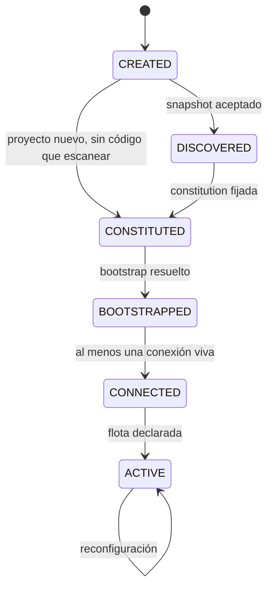
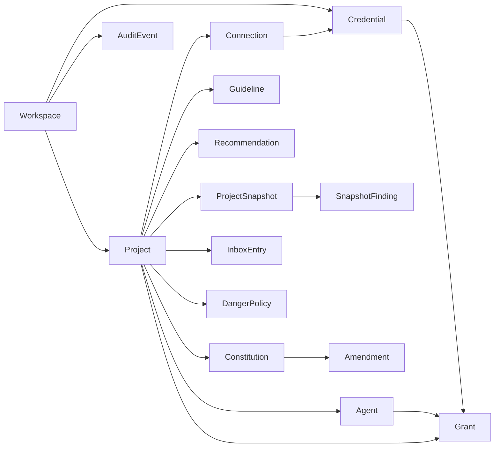

# Modelo de datos · Control Plane 00–07

**Branch**: `002-control-plane` | **Spec**: [spec.md](./spec.md)

## La regla que ordena todo lo demás

El estado se parte en dos almacenes, y el criterio no es de gusto: **quién lo escribe y quién lo lee bajo presión**.

| | Archivos atómicos en `$NOXLOOP_HOME` | Almacén consultable (SQLite) |
|---|---|---|
| Qué guarda | Estado del run, tareas, intentos, gates, locks | Proyectos, snapshots, credenciales, grants, auditoría, recomendaciones, memoria |
| Quién escribe | `state.mjs`, único escritor | El servicio de control, único escritor |
| Quién lee | Hooks dentro de subprocesos, el motor, el board | La interfaz, vía la API |
| Por qué ahí | Un hook corre dentro de un worktree, sin dependencias y sin conexión abierta. Tiene que leer un archivo y decidir en milisegundos. | La vista inversa de credenciales y la bandeja sobre 20 proyectos son consultas, no lecturas de archivo. Con archivos son escaneos completos. |

**Lo que esto prohíbe:** el almacén consultable no puede volverse la fuente de verdad del run. Si un hook necesitara abrir SQLite para saber si el rojo existe, el principio III de la constitution se rompe y con él la retomabilidad. Los 650 tests existentes que leen archivos siguen leyendo archivos.

**La única sincronización permitida** es de archivos hacia SQLite, en un solo sentido, y solo para proyección de lectura. Una proyección perdida se reconstruye releyendo los archivos; una discrepancia se resuelve siempre a favor del archivo.

---

## Entidades

### Workspace

Raíz de todo. Uno por instalación.

| Campo | Tipo | Notas |
|---|---|---|
| `id` | uuid | |
| `home` | ruta | `$NOXLOOP_HOME`, donde viven los archivos de estado |
| `creado` | instante | |
| `version_esquema` | entero | Para migraciones del almacén |

Relaciones: contiene N `Project`, N `Credential` de ámbito global, N `SharedResource`.

---

### Project

Contexto aislado. Todo lo demás cuelga de aquí.

| Campo | Tipo | Notas |
|---|---|---|
| `id` | uuid | |
| `nombre` | texto | |
| `slug` | texto | único en el workspace |
| `origen` | enum | `nuevo` \| `local` \| `remoto` |
| `ruta_local` | ruta | Dónde vive el árbol de trabajo |
| `remoto` | url | Nullable |
| `estado` | enum | Ver máquina de estados abajo |
| `creado`, `actualizado` | instante | |

**Máquina de estados** — un solo escritor, transiciones con guarda:

Reglas: ninguna transición salta un estado salvo la declarada (`CREATED → CONSTITUTED` para proyecto nuevo). Una transición sin su artefacto —snapshot sin aceptar, constitution sin fijar— se rechaza con causa textual. Retroceder no existe: se reabre la etapa sin cambiar el estado.

---

### ProjectSnapshot

Lectura técnica del proyecto. **Propuesta, no verdad.**

| Campo | Tipo | Notas |
|---|---|---|
| `id` | uuid | |
| `project_id` | uuid | |
| `commit` | sha | Punto exacto del análisis |
| `creado` | instante | |
| `estado` | enum | `en_curso` \| `completo` \| `cancelado` |
| `duracion_ms` | entero | Para NFR-001 |

#### SnapshotFinding

Un snapshot son sus hallazgos. Cada uno se defiende solo.

| Campo | Tipo | Notas |
|---|---|---|
| `id` | uuid | |
| `snapshot_id` | uuid | |
| `categoria` | enum | `stack` \| `arquitectura` \| `patrones` \| `testing` \| `ci` \| `dependencias` \| `guidelines` \| `agentes` \| `riesgos` |
| `clave` | texto | `runtime.node`, `testing.runner`, `ci.workflow` |
| `valor` | json | |
| `origen` | enum | `detectado` \| `inferido` \| `declarado` |
| `evidencia` | lista de rutas + líneas | **Obligatoria cuando `origen = detectado`** |
| `confianza` | enum | `alta` \| `media` \| `baja` |
| `decision` | enum | `pendiente` \| `aceptado` \| `corregido` \| `descartado` |
| `valor_corregido` | json | Nullable; gana sobre `valor` |

**Invariante (FR-013):** un hallazgo `detectado` sin `evidencia` no se persiste. Es el mismo principio del exit code aplicado a la lectura: sin el archivo que lo respalda, es una opinión del modelo.

**Invariante de seguridad:** si el scanner encuentra un secreto, emite un hallazgo `categoria = riesgos` con la ruta y **nunca** el valor, ni siquiera truncado.

*(Este documento decía `riesgo` en singular y `ci_cd`, y el contrato del scanner decía `riesgos` y `ci`. Manda el contrato, que es lo que la implementación consume; aquí quedan alineados. La divergencia la encontró quien implementó el scanner, no una revisión — que es el argumento para que los nombres de un enum vivan en un solo sitio.)*

---

### Constitution

| Campo | Tipo | Notas |
|---|---|---|
| `id`, `project_id` | uuid | |
| `version` | semver | |
| `ruta_en_repo` | ruta | Versionada junto al código (FR-021) |
| `contenido` | markdown | |
| `ratificada`, `enmendada` | instante | |
| `vigente` | bool | Una sola por proyecto |

#### ConstitutionAmendment

Porque la constitution del propio repo lo exige de sí misma, y lo que exigimos de nosotros lo exigimos del producto.

| Campo | Tipo | Notas |
|---|---|---|
| `id`, `constitution_id` | uuid | |
| `version_anterior`, `version_nueva` | semver | |
| `principio` | texto | Qué cambia |
| `fallo_que_motiva` | texto | **Obligatorio.** Sin fallo detrás no es enmienda, es preferencia |
| `que_se_rompe_si_no` | texto | Obligatorio |
| `fecha` | instante | |

---

### Guideline

| Campo | Tipo | Notas |
|---|---|---|
| `id`, `project_id` | uuid | |
| `area` | enum | `frontend` \| `backend` \| `testing` \| `git` \| `seguridad` \| `agentes` \| `diseno` |
| `ruta_en_repo` | ruta | |
| `contenido` | markdown | |
| `reglas_aplicables` | lista | Subconjunto que el runtime puede verificar, no solo leer |

---

### Recommendation

Salida del bootstrap. Nada se escribe sin decisión.

| Campo | Tipo | Notas |
|---|---|---|
| `id`, `project_id` | uuid | |
| `tipo` | enum | `hook` \| `skill` \| `mcp` \| `tool` \| `subagente` \| `validacion` \| `ci` \| `instrucciones` \| `documentacion` |
| `titulo`, `justificacion` | texto | |
| `diff` | texto | Los cambios exactos, calculados antes de proponer (FR-026) |
| `conflicto_constitution` | texto | Nullable. Si tiene valor, se propone marcada (FR-028) |
| `decision` | enum | `pendiente` \| `aplicada` \| `personalizada` \| `omitida` |
| `motivo_decision` | texto | Nullable, alimenta la evolución continua |
| `decidida` | instante | |

*(`instrucciones` y `documentacion` se añadieron al implementar el bootstrap. Los siete tipos originales describen piezas ejecutables, y un archivo de instrucciones para agentes no es ninguna de ellas: meterlo en `tool` lo etiqueta mal en la pantalla y, peor, en el registro de decisiones que alimenta la evolución continua — que es el único sitio donde el sistema aprende qué clase de propuesta acepta el operador y cuál descarta.)*

---

### Connection

| Campo | Tipo | Notas |
|---|---|---|
| `id`, `project_id` | uuid | |
| `clase` | enum | `tracker` \| `scm` \| `infra` \| `integracion` |
| `proveedor` | texto | `linear`, `jira`, `azure-devops`, `github`, `fake` |
| `id_externo` | texto | Identificador en la capa de integración |
| `estado` | enum | `pendiente` \| `viva` \| `expirada` \| `revocada` \| `fallida` |
| `credential_id` | uuid | La credencial que la habilita |
| `capacidades` | json | Lo que el proveedor declara saber hacer |

**Invariante (FR-032):** `scm` no es una integración. Git se habla directo; la capa de integración no se interpone.

---

### Credential

El valor **nunca** está aquí.

| Campo | Tipo | Notas |
|---|---|---|
| `id` | uuid | |
| `nombre` | texto | |
| `proveedor` | texto | |
| `tipo` | enum | `api_token` \| `tracker` \| `scm` \| `modelo` \| `ssh` |
| `ambito` | enum | `global` \| `proyecto` |
| `project_id` | uuid | Nullable si global |
| `alcance_declarado` | texto | Lo que el operador dice que puede hacer |
| `huella` | texto | Hash del valor. Cambia al rotar |
| `ref_boveda` | texto | Puntero al backend de secretos. **No es el valor** |
| `backend` | enum | `keychain_so` \| `archivo_cifrado` |
| `creada`, `expira` | instante | `expira` nullable |
| `aviso_dias_antes` | entero | Configurable (FR-046) |
| `estado` | enum | `activa` \| `por_expirar` \| `expirada` \| `revocada` |

**Invariantes:** ninguna columna contiene el secreto (FR-041). Serializar una `Credential` a JSON no puede producir el valor — hay un test que lo afirma sobre el objeto serializado, no sobre la intención.

#### SshAccess

SSH se modela aparte porque su superficie de riesgo es distinta: es un shell remoto donde no llegan los hooks locales.

| Campo | Tipo | Notas |
|---|---|---|
| `id`, `credential_id` | uuid | |
| `host`, `usuario`, `puerto` | texto/entero | |
| `huella_host` | texto | **Fijada.** Sin aceptación silenciosa de hosts desconocidos |
| `comandos_permitidos` | lista | Por defecto: solo lectura y diagnóstico |
| `escritura_autorizada` | bool | Por defecto `false`; se eleva por la bandeja |

---

### Grant

La tripleta. Denegar por defecto.

| Campo | Tipo | Notas |
|---|---|---|
| `id` | uuid | |
| `project_id`, `agent_id`, `credential_id` | uuid | La tripleta (FR-042) |
| `vigencia_desde`, `vigencia_hasta` | instante | `hasta` nullable |
| `concedido_por` | texto | Siempre una persona |
| `concedido_en` | instante | |
| `revocado_en` | instante | Nullable |

**Consulta obligatoria (FR-045), la vista inversa:** dada una `credential_id`, qué agentes y proyectos la alcanzan **hoy** — considerando vigencia y revocación, no solo existencia de la fila.

**Invariante:** no existe grant implícito. Un agente sin fila vigente no alcanza la credencial, aunque sea del mismo proyecto.

---

### Agent

| Campo | Tipo | Notas |
|---|---|---|
| `id`, `project_id` | uuid | |
| `nombre`, `rol` | texto | `implementador` \| `revisor` \| `planificador` \| `verificador` |
| `runtime` | enum | Identificador del adaptador |
| `modelo` | texto | |
| `skills`, `tools`, `mcps` | listas | Referencias a recursos compartidos |
| `permisos` | json | Qué puede hacer |
| `presupuesto` | json | Intentos, tokens, tiempo |
| `contexto` | json | Qué recibe del context compiler |

**Invariante (FR-034):** en un mismo proyecto, el agente con rol `revisor` no comparte `runtime` con el de rol `implementador`. Se valida al guardar, no al ejecutar.

---

### InboxEntry

| Campo | Tipo | Notas |
|---|---|---|
| `id` | uuid | |
| `project_id` | uuid | Nullable para entradas de workspace |
| `tipo` | enum | `pregunta_agente` \| `autorizacion_credencial` \| `permiso_tool` \| `gate_rojo` \| `conflicto_integracion` \| `hallazgo_revision` \| `decision_merge` \| `decision_despliegue` |
| `causa` | texto | **Textual y completa** (FR-062). No un resumen generado |
| `contexto` | json | Lo que hace falta para decidir sin salir de la app |
| `decisiones_posibles` | lista | |
| `estado` | enum | `esperando` \| `aprobada` \| `rechazada` \| `cambios_solicitados` \| `caducada` |
| `creada`, `resuelta` | instante | |
| `resuelta_por` | texto | |

Métrica que esta tabla habilita: **tiempo de bloqueo a respuesta** = `resuelta - creada`.

---

### AuditEvent

Append-only. Sin `UPDATE`, sin `DELETE`.

| Campo | Tipo | Notas |
|---|---|---|
| `id` | entero autoincremental | El orden importa |
| `instante` | instante | |
| `actor` | texto | Persona, agente o sistema |
| `accion` | texto | `grant.concedido`, `credencial.rotada`, `ssh.comando`, `danger.habilitado` |
| `objeto_tipo`, `objeto_id` | texto/uuid | |
| `resultado` | enum | `permitido` \| `denegado` \| `error` |
| `detalle` | json | **Redactado contra la bóveda antes de escribir** (FR-050) |
| `hash_anterior`, `hash` | texto | Encadenado: alterar una fila rompe la cadena y es detectable |

**Invariante (FR-049):** la aplicación no expone ninguna ruta que edite o borre esta tabla. El encadenamiento de hash existe para que una manipulación fuera de la app tampoco pase inadvertida.

---

### DangerPolicy

| Campo | Tipo | Notas |
|---|---|---|
| `id`, `project_id` | uuid | |
| `capacidad` | enum | `merge_autonomo` \| `despliegue` \| `bd_produccion` \| `comandos_destructivos` \| `infraestructura` \| `cuentas_externas` |
| `habilitada` | bool | **`false` por defecto, siempre** |
| `habilitada_por`, `habilitada_en` | texto/instante | |
| `condiciones` | json | |

**Invariante (FR-051):** el valor por defecto al crear la fila es `false`. No hay camino en la app que cree una con `true`.

---

### AutonomyLevel

Propiedad del proyecto, no tabla propia: `L0` … `L4`. En el alcance de esta feature el máximo alcanzable es `L2` — la autonomía termina en el PR abierto por principio IV de la constitution, y `L3`/`L4` pertenecen a la V1 del producto.

---

## Diagrama de relaciones

---

## Qué vive en archivos y qué en el almacén

| Archivos atómicos | Almacén consultable |
|---|---|
| Estado del run, tareas, intentos | `Project`, `ProjectSnapshot`, `SnapshotFinding` |
| Veredictos de gate con su exit code | `Constitution`, `Amendment`, `Guideline` |
| Locks | `Recommendation`, `Connection` |
| Rojo verificado por tarea | `Credential`, `SshAccess`, `Grant` |
| Presupuesto consumido | `InboxEntry`, `AuditEvent`, `DangerPolicy`, `Agent` |

La constitution, las guidelines y el diseño viven **además** versionados en el repositorio del proyecto (FR-021): el almacén guarda el puntero y la copia indexada, el repositorio guarda la verdad. Un proyecto clonado en otra máquina trae su contexto sin traer la base de datos.

**Lo que ningún almacén guarda:** el valor de una credencial. Vive en el backend de secretos del sistema operativo, y solo se materializa en el entorno del subproceso que tiene grant, en el instante en que se lanza (FR-044).
