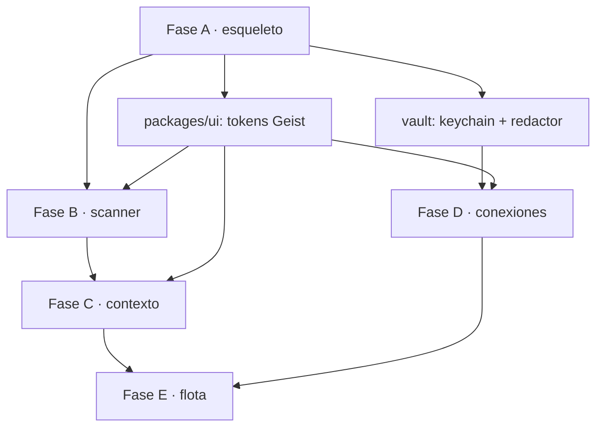

# Implementation Plan: Control Plane de proyecto · establecimiento 00–07

**Branch**: `002-control-plane` | **Date**: 2026-09-20 | **Spec**: [spec.md](./spec.md)

**Input**: [spec.md](./spec.md) · [research.md](./research.md) · [data-model.md](./data-model.md) · [contracts/](./contracts/)

---

## Summary

noxloop resuelve hoy las etapas 08–12: un ticket entra, sale un pull request. 849 tests en verde lo sostienen. Esta feature construye las etapas que van **antes** —00 a 07, el establecimiento del proyecto— y la capa de credenciales que las gobierna, sobre una superficie que es aplicación de escritorio y aplicación web con el mismo código.

El enfoque técnico en una frase: **una interfaz estática que no puede escribir, hablando contra un servicio local que es el único escritor, que envuelve el motor que ya existe.**

La restricción que lo hace posible es la que parecía un obstáculo. `output: 'export'` de Next no tiene servidor, ni acciones de servidor, ni rutas de API. Eso convierte FR-002 —la interfaz no escribe estado— en algo que el build hace imposible violar, en lugar de una regla que hay que recordar. Una restricción mecánica vale más que una convención.

---

## Technical Context

**Language/Version**: TypeScript 5.6+ sobre Node 20 (mínimo de CI; `.nvmrc` lo fija). El motor existente sigue en `.mjs` con `checkJs`.

**Primary Dependencies**:
- Interfaz: Next 16.3.5 (`output: 'export'`), React 19.3, Tailwind 4.3, shadcn/ui + Radix, `geist@1.7.2` (fuente), `next-themes`, `sonner`, `lucide-react`, `@tanstack/react-table`
- Escritorio: Tauri 2.11 + plugins `shell`, `dialog`, `store`, `opener`; crate `keyring` en un comando Rust
- Servicio: Node HTTP + SSE, sin framework web en el camino crítico
- Integraciones: `@nangohq/node` y `@nangohq/frontend` (**Elastic License 2.0**, aceptada — ver decisión en `contracts/connection-provider.md`)
- Almacén: SQLite embebido

**Storage**: híbrido. Archivos atómicos en `$NOXLOOP_HOME` para el estado del run (lo que ya existe y lo que los hooks leen); SQLite para proyectos, snapshots, credenciales, grants, auditoría y recomendaciones. Sincronización en un solo sentido, archivos → SQLite, y siempre proyección de lectura. Razonado en [data-model.md](./data-model.md).

**Testing**: `node --test` para el motor y el servicio (lo que ya se usa); Vitest + Testing Library para la interfaz; Playwright para el recorrido de punta a punta; suites de contrato para `AgentAdapter` y `ConnectionProvider`, al estilo de la que ya existe para proveedores de tickets.

**Target Platform**: macOS 12+, Windows 10+, Linux con glibc — y navegador moderno para el modo web.

**Project Type**: monorepo con aplicación de escritorio, aplicación web, servicio local y librerías.

**Performance Goals**: snapshot de 10.000 archivos < 60s (NFR-001); vista de inicio < 1s con 20 proyectos (NFR-002); arranque en frío del escritorio < 3s (SC-007).

**Constraints**: funciona sin internet para todo lo que no requiera un servicio externo (FR-003); cero secretos fuera de la bóveda, verificado por prueba (NFR-004); los 849 tests existentes en verde en cada commit (SC-010).

**Scale/Scope**: un operador, hasta ~20 proyectos, 8 etapas de establecimiento, ~25 pantallas.

### Prerrequisitos de la máquina

Comprobado hoy en este equipo:

| Herramienta | Estado | Acción |
|---|---|---|
| Node | v26.0.0 instalado; `.nvmrc` dice 20; CI prueba 20 y 22 | Fijar 20 para desarrollo. Node 26 no está en la matriz de CI, y desarrollar en una versión que nadie prueba es descubrir incompatibilidades en la máquina de otro |
| npm | 11.12.1 | Se mantiene `npm workspaces`. Cambiar a pnpm a mitad de la feature mueve 849 tests y el CI sin ganar nada hoy |
| Docker | 29.4.3 | Listo, para Nango |
| **Rust / cargo** | **NO INSTALADO** | **Bloqueante para Tauri.** Es la tarea 0 |
| Bun | No instalado | No hace falta: el sidecar va con Node embebido |

---

## Constitution Check

_GATE: debe pasar antes de Fase 0. Se vuelve a comprobar tras Fase 1._

Contra la constitution vigente, v1.1.0:

| Principio | Veredicto | Cómo |
|---|---|---|
| **I · Test primero, forzado por el sistema de archivos** | ✅ | El hook de TDD sigue intacto y vive en el subproceso del runtime. El código nuevo de esta feature se escribe con la misma disciplina: cada tarea lleva su test antes, y ese test falla contra el código viejo |
| **II · El criterio de éxito es un exit code** | ✅ | Se extiende: el scanner no declara "no escribí nada", lo prueba comparando el árbol; la bóveda no declara "no filtro secretos", planta un centinela y lo busca en la respuesta serializada |
| **III · El estado vive en disco, fuera de los repos** | ⚠️ **ampliado** | SQLite es proyección de lectura, nunca fuente de verdad del run. Un hook sigue decidiendo leyendo un archivo, sin abrir una base de datos. Discrepancia → gana el archivo. Requiere la ampliación descrita en la enmienda |
| **IV · La autonomía termina en el PR abierto** | ✅ | Intacto. L3 y L4 fuera de alcance; máximo L2. Las *danger options* se modelan pero ninguna ruta de la aplicación crea una habilitada |
| **V · El paralelismo lo gobierna el DAG** | ✅ | No se toca. La ejecución sigue siendo del motor |
| **VI · El gestor de tickets es un detalle, y se prueba que lo es** | ✅ | El mismo patrón se replica en `AgentAdapter` y `ConnectionProvider`: capacidades declaradas, degradación visible, suite de contrato, y añadir uno es añadir un archivo |
| **VII · La configuración es datos; el motor, código** | ✅ **ampliado** | Se extiende al servicio y a la interfaz. La guarda de genericidad de CI pasa a cubrir los paquetes nuevos |

**Tres principios nuevos**, propuestos en [constitution-amendment.md](./constitution-amendment.md) con su fallo medido detrás, como el documento exige:

- **VIII** · La interfaz lee; el motor y el servicio escriben.
- **IX** · El secreto vive en la bóveda y en el subproceso. En ningún otro sitio.
- **X** · Lo detectado se distingue de lo inferido, y el hueco se declara hueco.

**Estado del gate: pasa, condicionado a la enmienda.** No he tocado `.specify/memory/constitution.md`: cambiar la constitution sin el visto bueno del operador contradice el principio de puertas humanas que el producto vende.

### Lo que este plan se prohíbe

| Prohibido | Principio |
|---|---|
| Que la interfaz escriba disco, almacén o worktrees | VIII |
| Un segundo escritor del estado del run | III |
| Un endpoint que devuelva el valor de una credencial | IX |
| Un endpoint que edite o borre auditoría | IX |
| Crear una *danger option* habilitada | IV |
| Un `if` en el motor para soportar un runtime o un proveedor | VI |
| Un hallazgo `detectado` sin el archivo que lo respalda | X |
| Bajar un umbral o apagar un gate para que una tarea avance | Governance |

---

## Project Structure

### Documentación de la feature

```text
specs/002-control-plane/
├── spec.md                      # qué y por qué
├── plan.md                      # este archivo
├── research.md                  # Fase 0: tres investigaciones + 10 decisiones
├── data-model.md                # 14 entidades, máquina de estados, reparto de almacenes
├── constitution-amendment.md    # propuesta, no aplicada
├── contracts/
│   ├── control-api.md           # la costura interfaz ↔ servicio
│   ├── scanner.md               # la promesa de no escribir
│   ├── vault.md                 # bóveda, inyección, redacción, SSH
│   ├── agent-adapter.md         # sobre la costura real: driver.mjs:641
│   └── connection-provider.md   # el modo lo decide el catálogo
├── tasks.md                     # Fase 2
└── quickstart.md                # NO existe todavía: lo escribe T200, cuando haya algo que levantar
```

### Código

```text
noxloop/
├── apps/
│   ├── studio/                  # Next 16 static export. NO tiene servidor, a propósito
│   │   ├── app/
│   │   │   ├── [[...slug]]/     # catch-all: los IDs vienen del servicio en runtime
│   │   │   └── globals.css      # los tokens --ds-* de Geist
│   │   ├── lib/daemon.ts        # origen del servicio: isTauri() ? invoke : env
│   │   └── next.config.ts
│   └── desktop/
│       └── src-tauri/
│           ├── src/lib.rs       # sidecar, keychain, ciclo de vida
│           ├── binaries/        # node-<target-triple>
│           └── capabilities/
├── packages/
│   ├── engine/                  # EXISTE. 849 tests. No se reescribe
│   ├── plugin/                  # EXISTE. Plugin de Claude Code
│   ├── service/                 # el servicio de control. Único escritor del almacén
│   ├── store/                   # SQLite, migraciones, proyección desde archivos
│   ├── core/                    # dominio 00-07: proyecto, constitution, guidelines, bootstrap
│   ├── scanner/                 # etapa 01. Lee y no escribe
│   ├── vault/                   # bóveda, grants, auditoría, redactor
│   ├── connections/             # ConnectionProvider + adaptadores nango | local | fake
│   ├── adapters/                # AgentAdapter + claude-agent-sdk | codex | fake
│   └── ui/                      # componentes Geist-sobre-shadcn compartidos
└── providers/                   # EXISTE. Proveedores de tickets
```

**Por qué `service` y `engine` son paquetes distintos.** El motor tiene que poder correr sin el servicio — es como funciona hoy, es lo que prueban 849 tests, y es lo que permite que alguien use noxloop por CLI sin instalar una aplicación de escritorio. El servicio envuelve al motor; el motor no sabe que el servicio existe.

### La migración a TypeScript

Decisión: **el motor no se migra en esta feature.**

Los paquetes nuevos nacen en TypeScript. El motor sigue en `.mjs` con `checkJs`, que es como ya está tipado, y gana declaraciones `.d.ts` en su costura pública para que los paquetes nuevos lo consuman tipado.

El motivo es el criterio de riesgo del propio repositorio. Migrar 30 archivos `.mjs` con 849 tests detrás, en la misma feature que construye una superficie nueva, mete dos variables en el mismo experimento: cuando algo se rompa, nadie sabrá cuál de las dos fue. La migración es su propia feature, con su propio criterio de éxito —los mismos 849 tests en verde antes y después— y no está en el camino crítico de nada.

---

## Fases de entrega

Cada fase es un incremento usable, verificable y demostrable por separado. Ninguna depende de que la siguiente exista.

### Fase A · El esqueleto que arranca (US1 parcial)

**Entrega:** la aplicación de escritorio abre, el servicio arranca como sidecar, `/v1/health` responde, y la vista de inicio dice que no hay proyectos.

Parece poco y es la fase que más riesgo elimina. Tauri + Next static export + sidecar Node + token de sesión + SSE son cinco piezas que solo se sabe si encajan cuando encajan. Toda la trampa de `research.md` —CSP, CORS, `assetPrefix`, el origen del webview, el huérfano del sidecar— se paga aquí, con una aplicación que no hace nada y donde el fallo es legible.

- Rust instalado, Tauri andando
- `apps/studio` con los tokens de Geist y tema claro/oscuro
- `packages/service` con `/v1/health`, `/v1/capabilities` y `/v1/events`
- Sidecar con puerto efímero, token y watchdog de proceso padre
- **Salida verificable:** `npm run desktop` abre una ventana que dice "sin proyectos", y matar la app no deja el daemon huérfano

### Fase B · Escanear un proyecto real (US1, US2 · P1)

**Entrega:** apuntas la aplicación a un repositorio y obtienes un snapshot con hallazgos que puedes corregir. Y crear un proyecto nuevo desde plantilla.

- `packages/store` con SQLite y migraciones
- `packages/scanner` con detectores por ecosistema
- Endpoints de proyecto y de escaneo, progreso por SSE
- Pantallas: lista de proyectos, alta, snapshot con hallazgos
- **Salida verificable:** se escanea **este repositorio** y el snapshot encuentra Node 20, módulos ES, `node --test`, el workflow de CI, la constitution, el plugin y los cuatro proveedores — con `git status --porcelain` vacío antes y después

Al final de esta fase el producto ya es útil sin una sola credencial.

### Fase C · Contexto y setup (US3, US4 · P2)

**Entrega:** constitution propuesta desde el snapshot, editable y versionada; guidelines por área; bootstrap que detecta lo existente y propone con diff exacto.

- `packages/core` con constitution, enmiendas, guidelines y motor de recomendaciones
- Escritura versionada en el repositorio del proyecto
- Pantallas con `Fieldset`, `JSON View` y `File Tree`
- **Salida verificable:** el bootstrap corre sobre este repositorio y **no vuelve a proponer** los hooks, skills y plugin que ya existen

### Fase D · Credenciales y conexiones (US5 · P2)

**Entrega:** conectar un tracker, inventario de credenciales, grants, vista inversa, auditoría.

Es la fase de mayor riesgo y la que más pruebas lleva.

- `packages/vault`: keychain por comando Rust, fallback cifrado declarado, redactor
- `packages/connections`: `ConnectionProvider` + adaptadores `nango`, `local`, `fake`
- Nango en Docker con `SERVER_PORT=3003` explícito y aplicaciones OAuth propias
- Auditoría append-only con hash encadenado
- Pantallas con `SecretValue`, `Entity` y `Destructive Action Modal`
- **Salida verificable:** las 12 pruebas de no filtración en verde, y una tarea sin grant se bloquea y aparece en la bandeja

### Fase E · Flota y handoff (US6, US7, US8 · P3)

**Entrega:** declarar agentes, bandeja funcional, y lanzar un ciclo del motor desde la aplicación.

- `packages/adapters` con `AgentAdapter`, el de referencia y **Codex** como segundo
- Validación de revisor con runtime distinto
- Bandeja e indicadores agregados
- Handoff: contexto compilado → motor
- **Salida verificable:** con el proveedor `fake`, un proyecto establecido en la aplicación llega a PR abierto de punta a punta, sin intervención

---

## Paralelización

Lo que el desarrollo en paralelo permite aquí no es "hacer todo a la vez": es que los contratos ya escritos dejen trabajar a varios frentes sin pisarse. Las costuras están definidas antes de que exista una línea de implementación, que es la condición para que el paralelismo no produzca integraciones imposibles.



Frentes que corren a la vez sin tocarse, una vez cerrada la Fase A:

| Frente | Paquetes | Contrato que lo aísla |
|---|---|---|
| Scanner | `packages/scanner` | `contracts/scanner.md` |
| Bóveda | `packages/vault`, comando Rust | `contracts/vault.md` |
| Conexiones | `packages/connections` | `contracts/connection-provider.md` |
| Adaptadores | `packages/adapters` | `contracts/agent-adapter.md` |
| Sistema de diseño | `packages/ui` | tokens y componentes de `research.md` §2 |
| Almacén | `packages/store` | `data-model.md` |

La regla de reparto es la misma que gobierna el DAG del motor: **dos frentes corren a la vez si y solo si no hay arista entre ellos.** El servicio (`packages/service`) es el nodo con más aristas entrantes, así que sus endpoints se abren por fase, no todos al principio.

---

## Riesgos y cómo se cortan

| Riesgo | Corte |
|---|---|
| **Las cinco piezas de la superficie no encajan** | Fase A existe solo para descubrirlo con una aplicación vacía, donde el fallo es legible |
| **Rust no está instalado** | Tarea 0, antes que nada |
| Los tokens de Geist salen del stylesheet de producción, no de documentación autorizada | Se fijan en nuestro CSS y se revisan a mano. Cambian sin aviso, y lo sabemos |
| `@vercel/geistcn` aparece publicado a mitad del camino | `packages/ui` queda aislado tras sus propios componentes. Migrar sería sustituir su interior |
| El puerto 3003 de Nango está ocupado | `preflight` lo comprueba al arrancar y falla ruidosamente. No hay reasignación dinámica posible: el puerto está registrado en cada aplicación OAuth |
| SSE se ahoga en Linux | **Una sola** conexión multiplexada desde el primer día, no una por componente |
| El alcance es más grande que el equipo | Cinco fases, cada una usable sola. Es el riesgo número uno de la definición de producto, y la mitigación que ella misma propone |
| Un secreto se filtra | 12 pruebas con centinela, en CI, en cada commit. Es el único fallo sin segundo intento |
| La migración a TypeScript del motor se cuela en el camino crítico | Declarado fuera de alcance. Es su propia feature |

---

## Lo que el CI tiene que ganar

El CI actual verifica que la documentación no mienta: corre los comandos que los documentos mandan correr y falla si un archivo citado no existe. Es un listón alto y lo nuevo no puede bajarlo.

| Paso nuevo | Qué protege |
|---|---|
| `typecheck` de los paquetes TypeScript | Lo mismo que hoy protege en el motor |
| Build de `apps/studio` | Que el export estático siga siendo estático |
| `tauri build` en las tres plataformas, en etiquetas | Que el escritorio compile donde se distribuye |
| **Pruebas de no filtración** | El invariante sin segundo intento |
| **El scanner no escribe** | La promesa de la etapa 01, sobre repositorios reales |
| Suites de contrato de `AgentAdapter` y `ConnectionProvider` | Lo mismo que ya hace la de proveedores |
| Guarda de genericidad extendida a los paquetes nuevos | Principio VII, ahora sobre tres paquetes más |
| Los comandos que la documentación nueva manda correr, corridos | El listón que ya existe |

---

## Progress Tracking

- [x] Fase 0 · Investigación — tres frentes, 10 decisiones, lo no verificado declarado
- [x] Fase 1 · Diseño — data model, cinco contratos, enmienda propuesta
- [ ] **Puerta humana: aprobar la enmienda a la constitution**
- [ ] Fase 2 · Tareas — `tasks.md`
- [ ] Fase A … E
