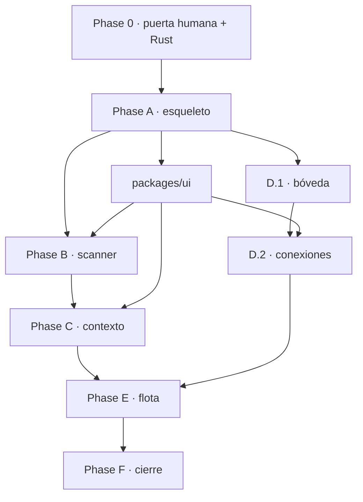

# Tasks: Control Plane de proyecto · establecimiento 00–07

**Input**: Design documents from `/specs/002-control-plane/`

**Prerequisites**: spec.md, plan.md, research.md, data-model.md, contracts/, constitution-amendment.md

**Tests**: OBLIGATORIOS. El principio I fija TDD como mecanismo, no como
preferencia: toda tarea con lógica nueva lleva su test ANTES que la
implementación, y ese test debe fallar contra el código viejo. Esta feature se
construye con la disciplina que el producto impone a sus usuarios.

**Invariante que atraviesa todo**: los 849 tests existentes quedan en verde en
cada commit (SC-010). Un commit que los rompe no se integra, aunque lo nuevo
funcione.

## Format: `[ID] [P?] [Fase] Description`

- **[P]**: Puede correr en paralelo — archivos distintos, sin dependencias abiertas
- **[Fase]**: A qué fase de entrega pertenece (A…E)
- Rutas relativas a la raíz del repositorio

---

## Phase 0: Puerta humana y prerrequisitos

**Bloquea todo lo demás.**

- [X] T000 **PUERTA HUMANA**: aprobar, corregir o rechazar `constitution-amendment.md`. Los tres principios nuevos gobiernan decisiones de las fases A, D y B respectivamente; implementarlas antes de que estén ratificadas es construir sobre reglas que pueden cambiar
- [X] T001 Instalar Rust y la cadena de Tauri; `cargo --version` y `rustc --print host-tuple` responden. **Bloqueante de la fase A**
- [X] T002 [P] Fijar Node 20 para desarrollo (`.nvmrc` ya lo dice). Node 26 no está en la matriz de CI
- [X] T003 [P] Añadir `tsconfig.base.json` con project references. El `tsconfig.json` actual (`checkJs` sobre `.mjs`) se conserva sin tocar para el motor y los proveedores
- [X] T004 [P] Registrar `apps/*` en los workspaces de npm del `package.json` raíz

---

## Phase A: El esqueleto que arranca

**Propósito**: descubrir si las cinco piezas de la superficie encajan, con una aplicación que no hace nada y donde el fallo es legible.

**Criterio de salida**: `npm run desktop` abre una ventana que dice "sin proyectos", y matar la aplicación no deja el daemon huérfano.

### A.1 · Interfaz

- [X] T010 [A] Crear `apps/studio` con Next 16, `output: 'export'`, `images.unoptimized`, `trailingSlash`, y `assetPrefix` solo en desarrollo
- [X] T011 [A] Ruta catch-all `app/[[...slug]]/page.tsx` con `generateStaticParams()` devolviendo `[{ slug: [] }]`
- [X] T012 [P] [A] `npm i geist` y cargar `GeistSans`/`GeistMono` con `next/font`. Test: el build no hace peticiones de red en runtime
- [X] T013 [P] [A] `packages/ui`: declarar las 10 escalas `--ds-*` en claro y oscuro, las sombras `--ds-shadow-*` y `--ds-focus-ring`, con los valores de `research.md` §2.2
- [X] T014 [A] `next-themes` con `attribute="class"`, `defaultTheme="system"`. Test: alternar tema no produce destello
- [X] T015 [P] [A] `shadcn init` + primitivas base, con los tokens de shadcn mapeados a `--ds-*`

### A.2 · Servicio

- [X] T020 [A] Test primero: `/v1/health` devuelve `escritorUnico: true` y el `home` resuelto
- [X] T021 [A] `packages/service`: servidor HTTP sobre `127.0.0.1`, **nunca** `0.0.0.0`, puerto efímero, imprime `NOXLOOP_READY <url>` en stdout
- [X] T022 [A] Test primero: una petición sin token válido se rechaza con 401
- [X] T023 [A] Token de sesión: se recibe por `--token`, se valida en cada petición, y el `Origin` se comprueba contra la allowlist
- [X] T024 [A] Formato único de error `{ codigo, causa, accion }`. Test: **ningún** error de la API sale sin `accion` (NFR-006)
- [X] T025 [A] `/v1/events`: SSE con `Last-Event-ID`, buffer acotado y `sincronizar_completo` cuando el hueco lo excede
- [X] T026 [A] Watchdog: `--parent-pid` y `process.kill(pid, 0)` cada 2s; si el padre no está, salir
- [X] T027 [A] Lock del `home`: un segundo servicio sobre el mismo `home` se niega a arrancar y nombra el PID del primero
- [X] T028 [P] [A] `/v1/capabilities`: runtimes disponibles, backend de bóveda en uso, proveedor de conexiones, presencia del motor

### A.3 · Escritorio

- [X] T030 [A] `apps/desktop/src-tauri` con `frontendDist: "../out"`, `beforeBuildCommand` y `devUrl`
- [X] T031 [A] CSP con `connect-src` incluyendo `http://127.0.0.1:* http://localhost:* ipc: http://ipc.localhost`
- [X] T032 [A] CORS en el servicio: allowlist con `tauri://localhost`, `http://tauri.localhost` y `http://localhost:3000`. **Verificar `location.origin` en cada SO antes de cerrar la lista** (`research.md` §1, no verificado)
- [X] T033 [A] Empaquetar el binario de Node como `externalBin` con sufijo de target triple, y el código del servicio como `resources`
- [X] T034 [A] `lib.rs`: lanzar el sidecar, parsear `NOXLOOP_READY`, guardar el `CommandChild`
- [X] T035 [A] Test primero: al cerrar la aplicación no queda ningún proceso del daemon. Matar en `RunEvent::Exit` **más** el watchdog de T026
- [X] T036 [A] Comando `daemon_info` → `(url, token)` para el frontend
- [X] T037 [A] `apps/studio/lib/daemon.ts`: `isTauri()` dentro de `useEffect`; en web, `NEXT_PUBLIC_DAEMON_URL`
- [X] T038 [A] SSE con token en query string — `EventSource` no manda headers. **Una sola** conexión multiplexada para toda la aplicación
- [X] T039 [A] Pantalla de servicio caído: causa textual y acción concreta, nunca pantalla en blanco ni datos rancios (FR-005)

### A.4 · CI

- [X] T040 [P] [A] `typecheck` de los paquetes TypeScript
- [X] T041 [P] [A] Build de `apps/studio` verificando que la salida es estática
- [X] T042 [P] [A] Extender la guarda de genericidad a `apps/` y a los paquetes nuevos (principio VII)

---

## Phase B: Escanear un proyecto real · US1, US2 (P1)

**Criterio de salida**: se escanea **este repositorio** y el snapshot encuentra Node 20, módulos ES, `node --test`, el workflow de CI, la constitution, el plugin y los cuatro proveedores — con `git status --porcelain` vacío antes y después.

### B.1 · Almacén

- [X] T050 [B] Test primero: una migración aplicada dos veces no duplica nada
- [X] T051 [B] `packages/store`: SQLite, migraciones versionadas, escrituras en transacción
- [X] T052 [B] Esquema de `Project`, `ProjectSnapshot`, `SnapshotFinding` según `data-model.md`
- [X] T053 [B] Test primero: la máquina de estados rechaza una transición sin su artefacto, con causa textual
- [X] T054 [B] Transiciones con guarda, escritor único, incluida `CREATED → CONSTITUTED` para proyecto nuevo

### B.2 · Scanner

- [X] T060 [B] **Test primero, el que define la promesa**: `git status --porcelain` idéntico antes y después, sobre repositorios de varios ecosistemas
- [X] T061 [B] Test primero: ni siquiera se tocan archivos que git ignora — comparar mtime e inodos del árbol completo
- [X] T062 [B] `packages/scanner`: recorrido con exclusiones, progreso por fase y `AbortSignal`
- [X] T063 [B] Test primero: un hallazgo `detectado` sin `evidencia` no sale del scanner (principio X)
- [X] T064 [P] [B] Detector de stack: manifiestos, lockfiles, versión de runtime fijada
- [X] T065 [P] [B] Detector de arquitectura: estructura, monorepo y workspaces, capas
- [X] T066 [P] [B] Detector de testing: runner, ubicación, umbral de cobertura declarado
- [X] T067 [P] [B] Detector de CI/CD: workflows, qué comandos corren, qué gatea el merge
- [X] T068 [P] [B] Detector de agentes: `CLAUDE.md`, `.claude/`, `AGENTS.md`, MCP, hooks, skills
- [X] T069 [P] [B] Detector de guidelines: `CONTRIBUTING`, `docs/`, ADRs
- [X] T070 [B] Test primero, con centinela: un secreto plantado produce hallazgo de riesgo **con la ruta y sin el valor**
- [X] T071 [B] Detector de riesgos: secretos en claro, `.env` versionado, dependencias sin fijar
- [X] T072 [B] Test primero: sobre un repositorio vacío, huecos declarados y cero inferencias con confianza alta
- [X] T073 [B] Test de rendimiento: 10.000 archivos sintéticos bajo 60 segundos (NFR-001)
- [X] T074 [B] Test primero: cancelado a mitad deja estado `cancelado` y ningún snapshot completo
- [X] T075 [B] Test primero: rutas con espacios, acentos y enlaces simbólicos — funciona o falla con causa, nunca a medias
- [X] T076 [B] **Test de aceptación**: el scanner se detecta a sí mismo sobre este repositorio (SC-005 parcial)

### B.3 · Endpoints y pantallas

- [ ] T080 [B] `POST /v1/projects` con los tres orígenes; `no_es_repositorio` y `destino_no_vacio` con su acción
- [ ] T081 [B] `POST /v1/projects/:id/scan` + `DELETE /v1/scans/:id`; progreso y hallazgos por SSE
- [ ] T082 [B] `PATCH` de hallazgo y `POST /accept` → `DISCOVERED`
- [X] T083 [P] [B] `packages/ui`: `Entity`, `EmptyState`, `Description`, `StatusDot` — los que shadcn no trae
- [ ] T084 [P] [B] Pantalla de lista de proyectos. **No es una grilla de tarjetas** (FR-061)
- [ ] T085 [B] Asistente de alta con selector de carpeta (`tauri-plugin-dialog`) y adaptador web
- [ ] T086 [B] Pantalla de snapshot: hallazgos agrupados, **origen visible en cada uno**, corregir y descartar
- [ ] T087 [P] [B] Plantillas de proyecto nuevo
- [ ] T088 [B] CI: el paso "el scanner no escribe" sobre repositorios reales

---

## Phase C: Contexto y setup · US3, US4 (P2)

**Criterio de salida**: el bootstrap corre sobre este repositorio y **no vuelve a proponer** los hooks, skills y plugin que ya existen.

- [X] T100 [C] Test primero: `POST /constitution/amend` sin los tres campos devuelve 400
- [X] T101 [C] `packages/core`: constitution con enmiendas (`principio`, `fallo_que_motiva`, `que_se_rompe_si_no`) y versión anterior recuperable
- [X] T102 [C] Propuesta desde el snapshot, cada apartado marcado `detectado` / `inferido` / `vacio`
- [X] T103 [C] Escritura versionada en el repositorio del proyecto → `CONSTITUTED`
- [X] T104 [P] [C] Guidelines por área, versionadas junto al código
- [X] T105 [P] [C] Etapa de diseño, omitible sin bloquear (FR-023)
- [X] T110 [C] Test primero: el bootstrap detecta lo existente **antes** de proponer nada
- [X] T111 [C] Motor de recomendaciones con el diff exacto calculado antes de proponer
- [X] T112 [C] Test primero: `apply` con el árbol cambiado falla con `diff_obsoleto`. **Aplicar algo distinto de lo mostrado es como se pierde la confianza en un instalador**
- [X] T113 [C] Aplicar, personalizar, omitir — con registro de la decisión y su motivo
- [X] T114 [C] Test primero: una recomendación que contradice la constitution no se propone sin declarar el conflicto (FR-028)
- [X] T115 [P] [C] `packages/ui`: `Fieldset`, `JSON View`, `File Tree`
- [ ] T116 [C] Pantallas de constitution, guidelines y bootstrap
- [X] T117 [C] **Test de aceptación**: bootstrap sobre este repositorio detecta ≥90% del setup existente (SC-005)

---

## Phase D: Credenciales y conexiones · US5 (P2)

**La fase de mayor riesgo. Es el único invariante sin segundo intento.**

**Criterio de salida**: las 12 pruebas de no filtración en verde, y una tarea sin grant se bloquea y aparece en la bandeja.

### D.1 · Bóveda

- [X] T130 [D] Comando Rust sobre el crate `keyring`. **No se expone al webview**
- [X] T131 [D] Test primero: sin Secret Service, el backend cae al archivo cifrado y lo **declara** en `/v1/capabilities` — nunca en silencio
- [X] T132 [D] Fallback cifrado para headless, contenedor y CI
- [X] T133 [D] Test primero, con centinela: serializar cualquier entidad del inventario no produce el valor, ni truncado
- [X] T134 [D] `packages/vault`: inventario con huella, `ref_boveda`, backend declarado
- [X] T135 [D] Test primero: `recuperar` sin `MotivoDeAcceso` no compila; sin grant vigente lanza y audita el intento denegado
- [X] T136 [D] Grants: la tripleta, con vigencia opcional. Denegar por defecto
- [X] T137 [D] Test primero: `reach` no devuelve grants revocados ni expirados (vista inversa, FR-045)
- [X] T138 [D] Test primero: rotar cambia la huella y **conserva** los grants
- [X] T139 [D] Redactor: carga huellas, busca **por valor** y reemplaza por `[redactado:<nombre>]`
- [ ] T140 [D] Test primero: el evidence packet **en disco** nunca contuvo el centinela — sobre el archivo escrito, no sobre el objeto en memoria
- [ ] T141 [D] Auditoría append-only con hash encadenado. Test: no existe ruta en la API que la edite o borre
- [X] T142 [D] Test primero: el entorno del subproceso contiene **exactamente** lo declarado, ni una variable heredada de más
- [X] T143 [D] Test primero: ningún valor aparece en `argv` del proceso lanzado
- [ ] T144 [D] `DangerPolicy`: test de que ninguna ruta crea una habilitada (FR-051)
- [X] T145 [D] SSH: huella de host fijada, allowlist de lectura, bitácora de **cada comando**, sin `ForwardAgent`
- [ ] T146 [D] **Test de suite**: el centinela no aparece en ninguna respuesta de **ningún** endpoint, errores incluidos (NFR-004)

### D.2 · Conexiones

- [X] T150 [D] `ConnectionProvider` según contrato. Test: **ningún proveedor del catálogo sin modo declarado**
- [X] T151 [D] Test primero: con un proveedor de modo `pat`, `conectar` **no** devuelve URL de autorización
- [X] T152 [P] [D] Adaptador `fake`, sin red ni credenciales
- [X] T153 [P] [D] Adaptador `local`: PAT y claves de API contra la bóveda. Test: completa un ciclo **sin Docker**
- [ ] T154 [D] Adaptador `nango`: `docker-compose` con **`SERVER_PORT=3003` explícito** (el bug #5305, cerrado como *not planned*)
- [ ] T155 [D] `preflight` comprueba el puerto 3003 al arrancar y falla ruidosamente. No hay reasignación posible: está registrado en cada aplicación OAuth
- [ ] T156 [D] **Registrar aplicaciones OAuth propias** para Linear, Jira, GitHub. Es el seguro de portabilidad y solo funciona si está desde el principio
- [ ] T157 [D] Flujo: `connect_link` abierto en el **navegador del sistema** (`tauri-plugin-opener`), no en el webview
- [ ] T158 [D] Sondeo hasta que la conexión aparece. **Los webhooks no son el camino primario** (`research.md` §3, no verificado)
- [X] T159 [D] `credenciales()` con `vigencia_ms` ≤ 5 minutos. Test: no se cachea más allá de la vigencia
- [X] T160 [D] Test primero: con el adaptador caído, las conexiones existentes siguen y las nuevas fallan con causa; la aplicación no se cae
- [X] T161 [D] Declarar la licencia ELv2 en `LICENSE` y `README`, con lo que implica para quien redistribuya
- [X] T162 [P] [D] `packages/ui`: `SecretValue`, `Destructive Action Modal`
- [ ] T163 [D] Pantallas de conexiones, inventario de credenciales, grants y vista inversa
- [ ] T164 [D] Pantalla de auditoría, solo lectura
- [ ] T165 [D] CI: las 12 pruebas de no filtración, en cada commit

---

## Phase E: Flota y handoff · US6, US7, US8 (P3)

**Criterio de salida**: con el proveedor `fake`, un proyecto establecido en la aplicación llega a PR abierto de punta a punta, sin intervención (SC-009).

- [ ] T180 [E] Formalizar `AgentAdapter` sobre la costura real (`driver.mjs:641`), con el campo `env` nuevo
- [ ] T181 [E] Suite de contrato de adaptadores, 11 pruebas según `contracts/agent-adapter.md`
- [ ] T182 [P] [E] Adaptador `fake`
- [ ] T183 [P] [E] Adaptador `claude-agent-sdk`, formalizando lo que v1 ya hace
- [ ] T184 [E] **Adaptador `codex`**. Su función no es solo existir: si añadirlo obliga a tocar `driver.mjs`, el contrato está mal y lo descubrimos ahora
- [ ] T185 [E] Test primero: `phase: 'REVIEW'` nunca recibe `resume` distinto de `null` — el revisor no hereda el razonamiento del implementador
- [ ] T186 [E] Test primero: `activate` rechaza con `revisor_comparte_runtime` (FR-034)
- [ ] T187 [E] `Agent` con rol, runtime, modelo, skills, tools, MCP, permisos, presupuesto y contexto → `ACTIVE`
- [ ] T190 [P] [E] `InboxEntry` con causa textual **completa**, no resumen generado (FR-062)
- [ ] T191 [E] `GET /v1/dashboard`: indicadores agregados. Test: <1s con 20 proyectos (NFR-002)
- [ ] T192 [E] Pantalla de inicio con la bandeja como **único elemento accionable**, y el estado "bandeja vacía" explícito
- [ ] T193 [E] Test primero: `POST /runs` sobre un proyecto no `ACTIVE` devuelve 409 **nombrando la etapa que falta** (FR-064)
- [ ] T194 [E] Context compiler: constitution + guidelines + diseño + work item → contexto del run
- [ ] T195 [E] Test primero, al estilo del que ya protege el board: se mide el disco antes y después de un `GET /runs` y **no cambió nada**
- [ ] T196 [E] **Test de punta a punta**: proyecto establecido en la aplicación → PR abierto con el proveedor `fake` (SC-009)
- [X] T197 [P] [E] `packages/ui`: `Command Menu` (⌘K) para NFR-005
- [ ] T198 [E] Recorrido completo de teclado y tema claro/oscuro (NFR-005)

---

## Phase F: Cierre

- [ ] T200 [F] `quickstart.md`: cómo se levanta y cómo se verifica, con los comandos que el CI va a correr
- [ ] T201 [F] Actualizar `README.md` y `CHANGELOG.md`
- [ ] T202 [F] `docs/`: bóveda, conexiones y el sistema de diseño
- [ ] T203 [F] CI: los comandos que la documentación nueva manda correr, corridos — el listón que ya existe
- [ ] T204 [F] `tauri build` en las tres plataformas, en etiquetas
- [ ] T205 [F] **Test de aceptación de SC-001**: repositorio real desde "abrir la app" hasta `ACTIVE` en menos de 15 minutos, sin editar un archivo a mano y sin leer documentación

---

## Dependencias

**La regla es la del motor**: dos frentes corren a la vez si y solo si no hay arista entre ellos.

Una vez cerrada la fase A, corren en paralelo sin tocarse:

| Frente | Tareas | Aislado por |
|---|---|---|
| Scanner | T060–T076 | `contracts/scanner.md` |
| Bóveda | T130–T146 | `contracts/vault.md` |
| Sistema de diseño | T013, T083, T115, T162, T197 | `research.md` §2 |
| Almacén | T050–T054 | `data-model.md` |

Y dentro del scanner, los seis detectores (T064–T069) son seis archivos independientes: seis frentes más.

## Lo que ninguna tarea puede hacer

- Bajar un umbral, saltear un test, apagar un hook o recortar un gate para avanzar. **No está disponible** (Governance).
- Romper uno de los 849 tests existentes y seguir.
- Escribir estado desde la interfaz.
- Devolver el valor de una credencial por cualquier ruta.
- Persistir un hallazgo `detectado` sin el archivo que lo respalda.
